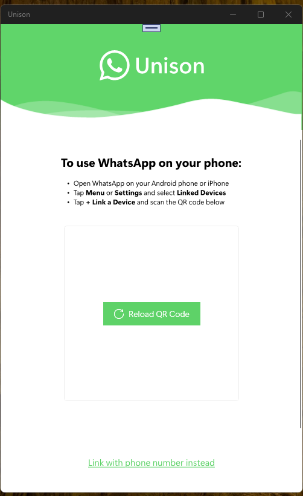

# Unison v 1.0.0 "pr-1" - main branch

Note: this is only my fork. Original is here: https://github.com/MaskNinjaSquared/Unison/

## About

UWP WhatsApp client aimed primarily for Windows 10 Mobile from porting Baileys
(secondary WhatsApp MD device client)

## Screenshot (Windows 11, not W10M)

## Tech. details
- Win. SDK Build = 19041
- Min. Win. SDK Build = 15063 

## Status

As is. Only forked by me (for future own mini-research). So, no special features.

What works:

- Message sending
- Image sending
- Contact names via their ~ name - not true contact names from phone yet (wait to load)
- Profile pictures (wait a lot, be patient)
- Starting new chats with completely new numbers (I know, right?)

What needs to work:

- Session saving
- A lot more

## About Original Version (Words of author, MaskNinjaSquared)

"
Release pre-alpha 11-01-26: 

Basic session saving implemented as well as what the README already mentions working.

x86 build is unsigned.

Please ensure the primary devices stays on WhatsApp until WhatsApp stops saying "Keep app open on both devices". This is critical. "

Where to download "pr-1" appx (url):
- https://github.com/MaskNinjaSquared/Unison/releases/tag/pr-1

## TODO
- Try to test it (if WhatsApp not blocked, of cause)

## References
- https://github.com/MaskNinjaSquared/Unison/ Project Unison (Original)
- https://github.com/MaskNinjaSquared Main Developer of Unison project 

## ..
- ME 2026

